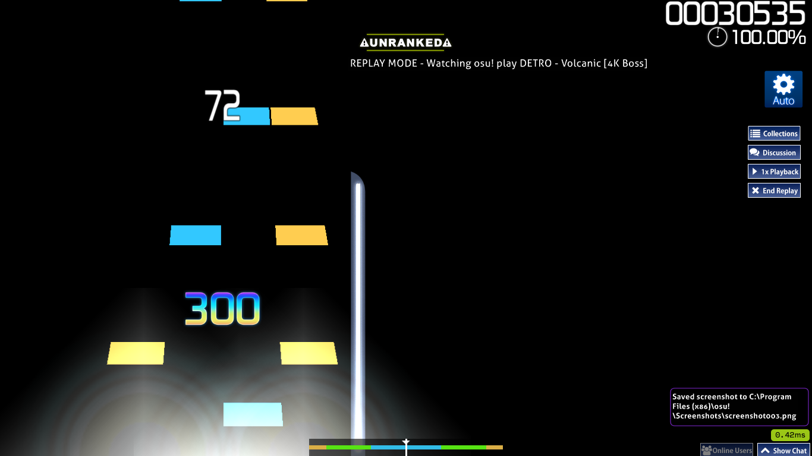

# 4k3d

An experiment with getting perspective added to notes in mania, similar to games like Guitar Hero or Sound Voltex. Based on animated notes and negative column spacing.

## Install
1. Navigate to osu folder
2. Go to skins folder
3. Copy over the 4k3d folder

## Notes
Only skinned for osu!mania

Intended for 1366x768

Requires speed set to 30

Only functional for 4k

## Issues
Hold notes need improvement, but are difficult to get anywhere with
